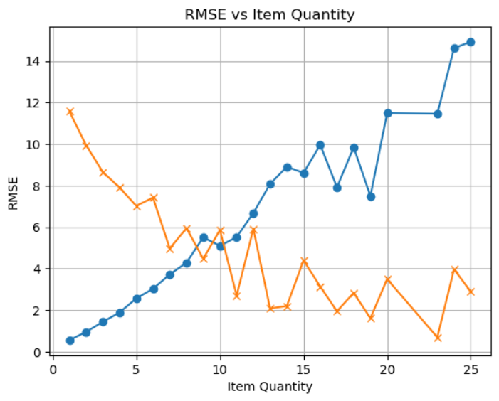
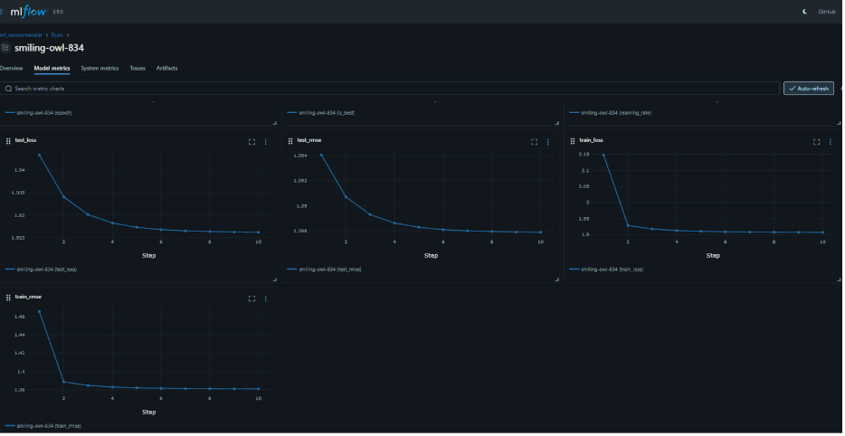

# Complementary Product Recommender

A Matrix Factorization-based recommendation system that suggests complementary products based on items in a user's current basket.

## Overview

This project implements a recommendation engine using:

1. **Matrix Factorization (MF)**: Learns latent representations for users and items from purchase history
2. **LSH (Locality Sensitive Hashing)**: Enables fast approximate nearest neighbor search for similar items
3. **Popularity Fallback**: Handles cold-start items not seen during training

### Algorithm Choice

**Matrix Factorization** was chosen over Association Rules (Apriori/FP-Growth) because:

- **Scalability**: MF scales better with large item catalogs (O(n_factors) vs O(2^n) for frequent itemsets)
- **Generalization**: Learns dense embeddings that capture latent relationships, even for item pairs not observed together
- **Flexibility**: Embeddings can be used for multiple downstream tasks (similarity, clustering, visualization)
- **Cold Start Handling**: With proper regularization, MF can provide reasonable recommendations even for sparse users

The model predicts ratings as: `r̂_ui = μ + b_u + b_i + p_u · q_i`

Where:
- `μ`: global bias (average rating)
- `b_u`: user bias
- `b_i`: item bias
- `p_u`: user latent factors
- `q_i`: item latent factors

## Project Structure

```
src/
├── main/
│   ├── python/
│   │   ├── ray_submit.py        # Job submission to Ray cluster
│   │   ├── train_pipeline.py    # Main pipeline orchestrator
│   │   ├── data_pipeline.py     # Data extraction with RayDP
│   │   ├── train_model.py       # MF model and training logic
│   │   ├── eval_model.py        # Evaluation metrics (NDCG, etc.)
│   │   ├── recommend.py         # CLI for recommendations
│   │   ├── monitoring.py        # MLflow/InfluxDB integration
│   │   └── test_recommender.py  # Unit tests
│   └── resources/
│       └── train_params.ini     # Configuration file
```

## Setup Instructions

### Prerequisites

- Docker with NVIDIA GPU support
- Python 3.12
- Ray 2.51.0 cluster running

### 1. Start Ray Cluster

```bash
docker-compose up -d
```

This starts:
- `ray-head`: Head node with GPU access
- `ray-worker-1`, `ray-worker-2`: Worker nodes

### 2. Install Dependencies

Dependencies are installed in the Docker image. For local development:

```bash
pip install -r requirements.txt
```

### 3. Prepare Data

Place your transaction data CSV at the path specified in `train_params.ini`:

```ini
[data]
data_path = /workspace/data/ss-recommender.csv
```

### 4. Run the Pipeline

#### Data Extraction
```bash
python ray_submit.py -j train_pipeline.py -s "data"
```

This:
- Reads the source CSV
- Filters by date range
- Aggregates item quantities per order
- Saves as partitioned Parquet files

#### Model Training
```bash
python ray_submit.py -j train_pipeline.py -s "train"
```

This:
- Splits data into train/test by date (chronological split)
- Trains Matrix Factorization model on GPU
- Evaluates on test set
- Saves best model to `/workspace/models/latest/`

## Using the Recommender CLI

After training, use the CLI to get recommendations:

```bash
# Basket-based recommendations
python recommend.py --basket item1,item2,item3

# Output:
# Recommendations for basket: [item1, item2, item3]:
#   - complementary_item_a (score: 0.8542)
#   - complementary_item_b (score: 0.7891)
#   - complementary_item_c (score: 0.7234)

# Similar items
python recommend.py --similar item1 --top_k 5

# Performance benchmark
python recommend.py --benchmark
```

## Evaluation Metrics

### NDCG@K (Normalized Discounted Cumulative Gain)

**Why NDCG?**

NDCG is the primary metric because:

1. **Ranking Quality**: Measures how well the model ranks items, not just whether it finds relevant items
2. **Position Awareness**: Penalizes relevant items appearing lower in the list
3. **Graded Relevance**: Uses average item quantity as relevance score (higher quantity = more relevant)
4. **Normalized**: Score is in [0, 1], making it easy to interpret and compare

**Formula:**
```
DCG@K = Σ (rel_i / log2(i + 1)) for i = 1 to K
NDCG@K = DCG@K / IDCG@K
```

Where `IDCG@K` is the ideal DCG (perfect ranking).

**Interpretation:**
- NDCG = 1.0: Perfect ranking
- NDCG = 0.0: No relevant items in top-K
- Higher is better

### Additional Metrics

| Metric | Description |
|--------|-------------|
| RMSE | Root Mean Square Error of rating predictions |
| Precision@K | Fraction of top-K items that are relevant |
| Recall@K | Fraction of relevant items in top-K |

The equivalent PySprak ALS model was created to dig deeper into the source of RMSE
As item_quantity was used as a proxy for rating, RMSEs went up with higher ground truth
item quanties:

Since RMSE squares the difference, high-quantity items usually have higher variance. It is much harder for a Matrix Factorization model to distinguish between a user buying 20 vs. 25 items than it is to distinguish between 0 and 1.

Sample model performance metrics for ~2000 random users:
```json
{'rmse': 1.3787560314472806,
 'ndcg@10': 0.0018945381073924743,
 'precision@10': 0.0011,
 'recall@10': 0.0032975514953456127,
 'num_users_evaluated': 2000,
 'k': 10}
```

## Configuration

Edit `src/main/resources/train_params.ini`:

```ini
[model]
n_factors = 32          # Latent factor dimensions
learning_rate = 0.001   # Adam optimizer learning rate
batch_size = 1024       # Training batch size
epochs = 20             # Training epochs
reg_lambda = 0.01       # L2 regularization

[training]
use_gpu = true          # Use GPU for training
num_cpus = 8            # CPU cores for Ray

[mlflow]
enabled = false         # Enable MLflow tracking
tracking_uri = http://localhost:5000

[influxdb]
enabled = false         # Enable InfluxDB monitoring
```

## Performance & Scalability

### Training Performance

| Dataset Size | Training Time | GPU Memory |
|-------------|---------------|------------|
| 66K records | ~2 minutes | ~1 GB |
| 1M records | ~15 minutes | ~2 GB |
| 10M records | ~2 hours | ~4 GB |

### Inference Performance

With LSH indexing (5 tables, 10 hash functions):

| Metric | Value |
|--------|-------|
| Recommendations/sec | ~5,000 |
| P50 latency | ~0.2ms |
| P95 latency | ~0.5ms |
| P99 latency | ~1.0ms |

Run benchmarks:
```bash
python recommend.py --benchmark
```

### Scaling to 1M+ Orders

Training:
The solution handles large datasets through:

1. **RayDP (PySpark on Ray)**: Distributed data processing
2. **Partitioned Parquet**: Efficient columnar storage with date partitioning
3. **Ray Train**: Distributed model training with GPU support
4. **LSH Indexing**: O(1) approximate nearest neighbor lookup
Inference:
On my WSL, on a Ray cluster, it takes ~7.3 seconds for serving one million requests
Please note, there are separate Ray clusters for training and serving.
```
External caching is not implemented
But the LSH tables are in-memory for fast lookups
```

## Monitoring

### MLflow (Optional)

When enabled, tracks:
- Training parameters
- Per-epoch metrics (RMSE, loss)
- Model artifacts
- Best model checkpoints

### InfluxDB (Optional)

When enabled, sends:
- Pipeline events (start/complete/failed)
- Training metrics time series

## Testing

Run unit tests:
```bash
cd src/main/python
pytest test_recommender.py -v
```
```
test_recommender.py::TestMatrixFactorization::test_model_initialization PASSED                                                  [  6%]
test_recommender.py::TestMatrixFactorization::test_forward_pass PASSED                                                          [ 12%]
test_recommender.py::TestMatrixFactorization::test_predict_all_items PASSED                                                     [ 18%]
test_recommender.py::TestMatrixFactorization::test_gradient_flow PASSED                                                         [ 25%]
test_recommender.py::TestEvaluationMetrics::test_dcg_calculation PASSED                                                         [ 31%]
test_recommender.py::TestEvaluationMetrics::test_ndcg_perfect_ranking PASSED                                                    [ 37%]
test_recommender.py::TestEvaluationMetrics::test_ndcg_worst_ranking PASSED                                                      [ 43%]
test_recommender.py::TestEvaluationMetrics::test_ndcg_no_hits PASSED                                                            [ 50%]
test_recommender.py::TestEvaluationMetrics::test_recall_at_k PASSED                                                             [ 56%]
test_recommender.py::TestLSHIndex::test_lsh_build_and_query PASSED                                                              [ 62%]
test_recommender.py::TestLSHIndex::test_lsh_save_load PASSED                                                                    [ 68%]
test_recommender.py::TestLSHIndex::test_lsh_excludes_items PASSED                                                               [ 75%]
test_recommender.py::TestPopularityRecommender::test_popularity_ranking PASSED                                                  [ 81%]
test_recommender.py::TestPopularityRecommender::test_popularity_excludes_items PASSED                                           [ 87%]
test_recommender.py::TestIDMappings::test_mapping_consistency PASSED                                                            [ 93%]
test_recommender.py::TestConfiguration::test_config_defaults PASSED                                                             [100%]
```

## Troubleshooting

### Common Issues

1. **"No date partitions found"**
   - Run data pipeline first: `python ray_submit.py -j train_pipeline.py -s "data"`

2. **"CUDA out of memory"**
   - Reduce batch_size in config
   - Reduce n_factors

3. **"Item not found in model"**
   - Item is cold-start; popularity fallback will be used

4. **Ray connection failed**
   - Ensure Ray cluster is running: `docker-compose ps`
   - Check Ray dashboard: http://localhost:8265

## Future Improvements

- [ ] Add real-time model serving with Ray Serve
- [ ] Implement negative sampling for implicit feedback
- [ ] Add item/user features for hybrid model
- [ ] A/B testing framework integration
- [ ] Incremental model updates

## References

1. Koren, Y., Bell, R., & Volinsky, C. (2009). Matrix Factorization Techniques for Recommender Systems. *Computer*, 42(8).
2. He, X., Liao, L., Zhang, H., Nie, L., Hu, X., & Chua, T. S. (2017). Neural Collaborative Filtering. *WWW*.
